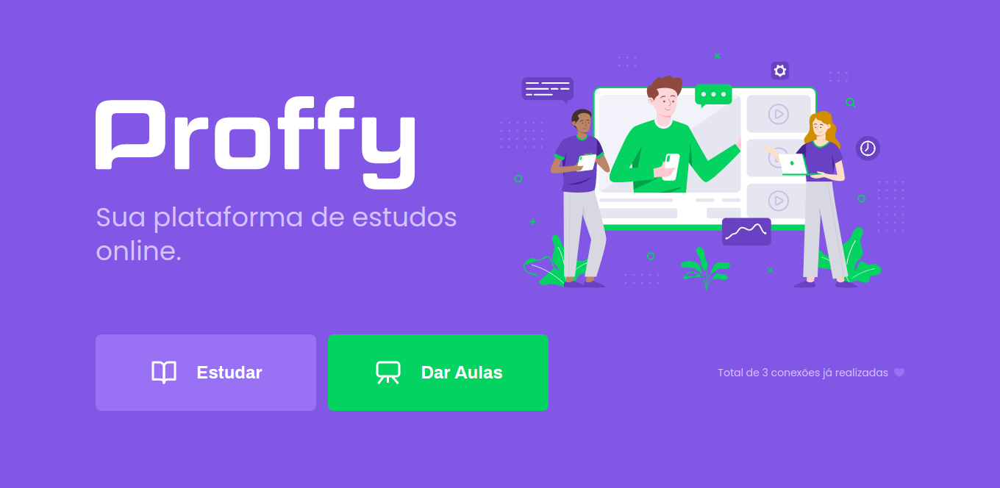
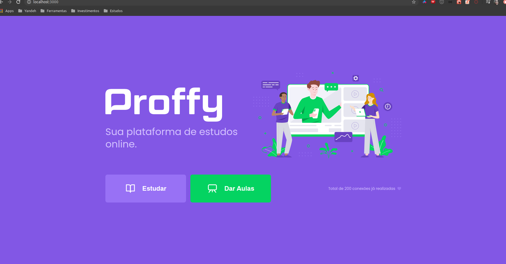
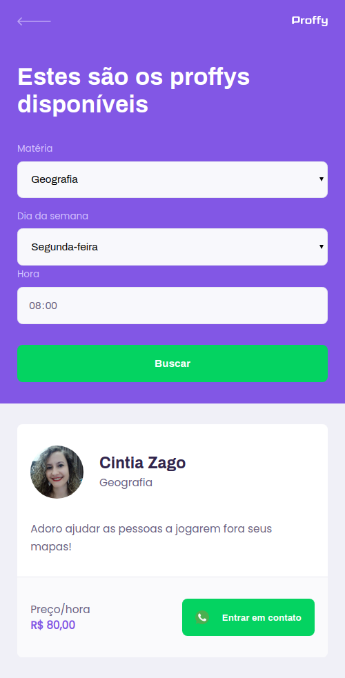
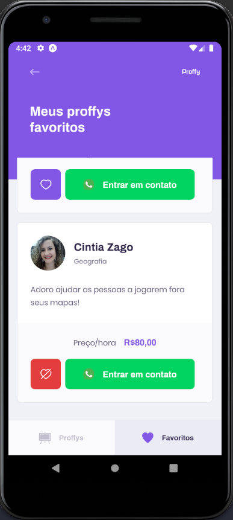

<h1 align="center">
    
</h1>

<h4 align="center"> 
	NextLevelWeek 2.0 🚀
</h4>
<p align="center">

  

  
	
  <a href="https://github.com/Alquipo/Proffys/commits/master">
    
  </a>

  

</p>
<p align="center">

<a target="_blank" href="https://nodejs.org/">
    
  </a>

  <a href="https://reactjs.org/">
  
</a>

 <a href="https://reactnative.dev/">
    
  </a>
  </p>

## :information_source: O que é Next Level Week?

O [NLW](https://nextlevelweek.com/inscricao/1) é uma semana prática com muito código, desafios, network e com um único objetivo: levá-lo ao próximo nível.
Através do método da [Rocketseat][rs], você aprenderá novas ferramentas, tecnologias e descobrirá hacks que irão impulsionar sua carreira.
Um evento online e totalmente gratuito que o ajudará a dar o próximo passo na sua evolução como desenvolvedor.

## 💻 Projeto

Proffy - É uma plataforma onde você pode estudar ou dar aulas. Um professor colocando seu dados, a matéria que quer ensinar, e escolher o melhor horário para dar a sua aula. Assim, os dados cadastrados ficaram disponíveis no site onde alunos podem escolher o professor que melhor se encaixa na em suas preferências.

Projeto desenvolvido durante a NLW - Next Level Week#02 oferecida pela [Rocketseat](https://rocketseat.com.br/).

<h3 align="center">
    
</h3>

## 🎨 Layout

Design feito por [Tiago Luchtenberg](https://www.instagram.com/tiagoluchtenberg/)

<table>
  <tr>
    <td colspan="2"><h4 align="center">Desktop</h4> </td>
    <td colspan="2"><h4 align="center">Mobile</h4></td>
  </tr>
  <tr>
    <td></td><td></td>
    <td></td><td></td>
  </tr>
</table>

## :hammer: Tecnologias

Este projeto foi desenvolvido com as seguintes Ferramentas:

- **[React][reactjs]**
- **[React Native][rn]**
- **[Node.js][nodejs]**
- **[Express](https://expressjs.com/)**
- **[TypeScript][typescript]**
- **[SQLite](https://www.sqlite.org/index.html)**
- **[Expo][expo]**
- **[VS Code][vs]**

## 🚀 Como rodar este projeto

Para clonar e executar este aplicativo, você precisará de [Git](https://git-scm.com), [Node.js][nodejs], [Expo][expo] Instalado em seu computador.

O projeto e divido em três partes:

1. Back End (pasta server)
2. Front End (pasta frontend)
3. Mobile (pasta mobile)

💡 Tanto o Front End quanto o Mobile precisam que o Back End esteja sendo executado para funcionar.

### :cyclone: Clonando o repositório

```bash
# Clone este repositório
$ git clone https://github.com/cintiazago/proffy.git

# Acesse a pasta do projeto no terminal/cmd
$ cd proffy
```

### 🎲 Rodando o Back End (servidor)

```bash
# Acesse a pasta do projeto do servidor
$ cd server

# Instale as dependências
$ yarn install

# Execute as Migrates
$ yarn knex:migrate

# Execute a Aplicação
$ yarn start

# O servidor inciará na porta:3333 - acesse http://localhost:3333/v1
```

### 🧭 Rodando a aplicação web (Front End)

```bash

# Vá para a pasta da aplicação Front End
$ cd frontend

# Instale as dependências
$ yarn install

# Execute a aplicação
$ yarn start

# A aplicação será aberta na porta:3000 - acesse http://localhost:3000
```

### 📱Rodando a aplicação mobile

```bash
# Vá para a pasta da aplicação Front End
$ cd mobile

# Instale as dependências
$ yarn install

# Execute a aplicação
$ yarn start

# A aplicação será aberta na porta:19002 - acesse http://localhost:19002

# Use o App expo baixado no seu celular para scan o QRCode
```

## ✏  Desafios futuros

- Como desafios propostos poderemos implementar a versão 2.0 do Proffy, contando com novas funcionalidades como:
  - Layout 2.0
  - Autenticação de usuários
  - Recuperação de senhas
  - Perfil do Proffy
  - Splash Screen no React Native com Expo
  - Paginação na listagem dos proffys
  - Exibir horários disponíveis dos proffys
  - Salvar os proffys favoritos no banco de dados
  - Logout da aplicação
  - Deploy da aplicação

  > Para mais detalhes sobre cada desafio acesse [Versão 2.0 Proffy](https://www.notion.so/Vers-o-2-0-Proffy-eefca1b981694cd0a895613bc6235970#e2f50daeb88245459c7ab119cc8a1d3e)

## 🤔 Como contribuir para o projeto

- Faça um **fork** do projeto;
- Crie uma nova branch com as suas alterações: `git checkout -b my-feature`
- Salve as alterações e crie uma mensagem de commit contando o que você fez:`git commit -m "feature: My new feature"`
- Envie as suas alterações: `git push origin my-feature`

> Caso tenha alguma dúvida confira este [guia de como contribuir no GitHub](https://github.com/firstcontributions/first-contributions)

## :memo: Licença

Este projeto esta sobe a licença MIT. Veja a [LICENÇA][license] para saber mais.

## 🦸 Autora

<h4 align="center"> 
 <a href="https://www.linkedin.com/in/cintiazago" alt="LinkedIn" target="blank">
    
  </a>

   <a href="mailto:cintiazago@gmail.com?subject=Olá%Cintia" alt="Email" target="blank">
    
  </a>

<br/>

Feito com ❤️ por Cintia Zago 👋🏽 [Entre em contato!](https://www.linkedin.com/in/cintiazago/)

</h4>

[nodejs]: https://nodejs.org/
[typescript]: https://www.typescriptlang.org/
[expo]: https://expo.io/
[reactjs]: https://reactjs.org
[rn]: https://facebook.github.io/react-native/
[vs]: https://code.visualstudio.com/
[rs]: https://rocketseat.com.br
[license]: https://opensource.org/licenses/MIT
